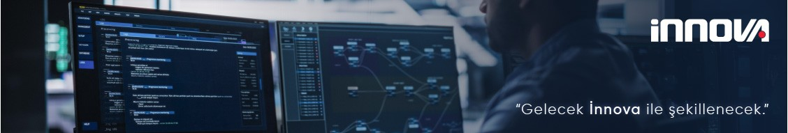

# İnnova Bilişim Çözümleri

**Geleceği Tasarlayan Yazılım ve Teknoloji Çözümleri**

İnnova Bilişim Çözümleri, kurumsal müşterilere yönelik yüksek ölçeklenebilir, güvenli ve sürdürülebilir yazılım sistemleri geliştiren bir teknoloji şirketidir. Finans, telekomünikasyon, havacılık ve kamu sektörlerinde uçtan uca dijital dönüşüm çözümleri sunmaktadır.

---

## 🧭 Hakkımızda

İnnova Bilişim Çözümleri A.Ş, farklı teknolojilerde bilgi birikimine sahip 1400 kişinin üzerindeki profesyonel kadrosu ile Türkiye’nin önde gelen bilişim çözümleri firmasıdır. 1999’dan bugüne telekomünikasyon, finans, üretim, kamu ve hizmet sektörleri başta olmak üzere her sektördeki kuruluşlara platform bağımsız çözümler sunan İnnova, uluslararası standartlarda ürettiği çözümleri şimdiye kadar 4 kıtada 37 ülkeye ihraç etmeyi başarmıştır. 
 
2007 yılından bu yana Türk Telekom Grubu Şirketleri bünyesinde yer alan İnnova Bilişim Çözümleri A.Ş, İstanbul ve Ankara ana ofisleri ile beraber Türkiye'nin çeşitli bölgelerine yayılmış toplamda 14 ofis üzerinden faaliyetlerine devam etmektedir.

---

## 📬 İletişim

🌐 Web: https://www.innova.com.tr  
📧 E-posta: info@innova.com.tr 
